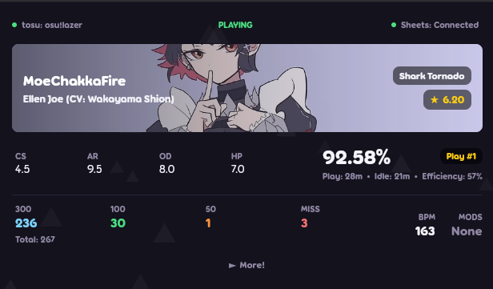

# circle-tracker (lazer & linux port)

A port of [FunOrange's circle-tracker](https://github.com/FunOrange/circle-tracker) that works on Linux and supports osu!lazer



## what changed
- rewritten with Avalonia UI on .NET 8 (tested on Arch Linux, untested on Windows/macOS)
- uses [tosu](https://github.com/tosuapp/tosu) for memory reading instead of the old Windows-only memory reader
- works with osu!lazer
- removed oppai.exe, winforms, and Windows-specific dependencies

## setup

### 1. install tosu
On Arch:
```bash
yay -S tosu
sudo setcap cap_sys_ptrace=eip /opt/tosu/tosu
```

### 2. run
```bash
# make sure tosu and osu! are running, then:
dotnet run
```
Paste your spreadsheet ID into the app, click connect, and that's it ! 

## build
```bash
dotnet build

# or standalone linux binary:
dotnet publish -c Release -r linux-x64 --self-contained -p:PublishSingleFile=true -o publish/
```

## credits
- [FunOrange](https://github.com/FunOrange) for the original circle-tracker
- design inspired by [osu-trainer](https://github.com/FunOrange/osu-trainer)
- [tosu](https://github.com/tosuapp/tosu) for the memory reader
